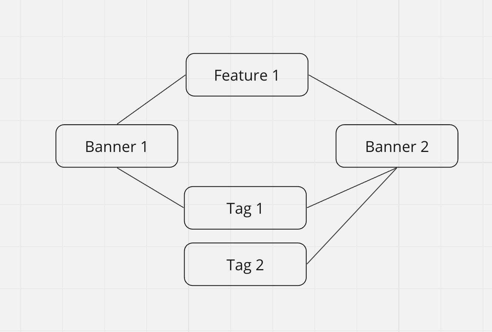

Приветствую и добро пожаловать в bannerlord! 
Ставьте лайк если поняли отсылку на Mount and Blade :)

## Содержание 
- Инструкция по запуску
- Описание проекта 
- Проблемы и решения 
- Концептуальные моменты 
- Что можно улучшить 


## Описание проекта 
Проект представляет собой сервис управления баннерами. 
Сервис реализован в соответствии с данным [заданием](https://github.com/avito-tech/backend-trainee-assignment-2024) 

Стэк: Golang, PostgreSQL, Docker.

Запросы приведены в [Postman](https://api.postman.com/collections/30546569-ff21b2a3-28c0-4b4a-8548-68c9adb6bd03?access_key=PMAT-01HVF3BFGSB1AN9QQXAQJGGW3E)

## Инструкция по запуску
1. Склонировать данный репозиторий
2. Перейти в директорию проекта
3. Выполнить следующие команды:
    ```
   make init
   make createdb
   make migrateup
   make runserver
   ```
Данные команды:
1. Запустят Docker-контейнер по публичному образу postgresql:16
2. Создадут необходимую базу данных в запущенном контейнере
3. Применят необходимые миграции
4. Создадут Docker-образ основного go-приложения
5. Запустят контейнер приложения по созданному образу

Контейнеры с СУБД и основным приложением работают в специально созданной Docker-сети.
Это сделано для большего удобства обмена данными между контейнерами. 

### Дополнительные make-команды
Вот список команд, которые могут помочь вам в тестировании данного проекта: 

## Проблемы и решения 
### Неоднозначные баннеры 
В задании было указано, что баннер однозначно определяется 
фичей и тэгом. К тому же, каждый баннер имеет одну фичу и несколько тэгов, а одна фича, как и один тэг 
могут принадлежать сразу нескольким баннерам. 
Таким образом, легко можно представить следующую ситуацию:


Таким образом, если придет запрос на получение баннера, 
имеющего feature 1 и tag 1, становится непонятно, какой из двух баннеров отдавать. 

Я не нашел способа математически различать баннеры с учетом передаваемой при запросе информации и поэтому 
придумал следующие решения: 
1. Отдавать все баннеры, которые имеют данный тег
2. Передавать дополнительную информацию в запросе. 

Я решил выбрать первый способ. Выбор продиктован текущими рабочими условиями. 
В реальном проекте, вероятно, понадобился бы дополнительный ресерч пользовательских ожиданий 
от поведения системы. 

### Недружелюбный Compose 
Я решил сделать деплой приложения через Docker Compose. 
Все шло хорошо до тех пор, пока docker не стал засыпать меня непонятными системными ошибками. 

Спустя 6 часов я все-таки сдался и реализовал процессы развертывания через makefile. 

В Docker Compose планировалось реализовать применение миграций на этапе компиляции. Как пример, я оставлю compose-файл
и соответствующий ему docker-файл в ветке ```compose```

## Что можно улучшить
1. Отделить базу данных, используемую для управления пользователями, от базы данных
основного сервиса. Таким образом получится в будущем облегчить переход к 
микросервисной архитектуре. 
2. Реализовать деплой при помощи Docker Compose 
3. Улучшить архитектуру API-слоя